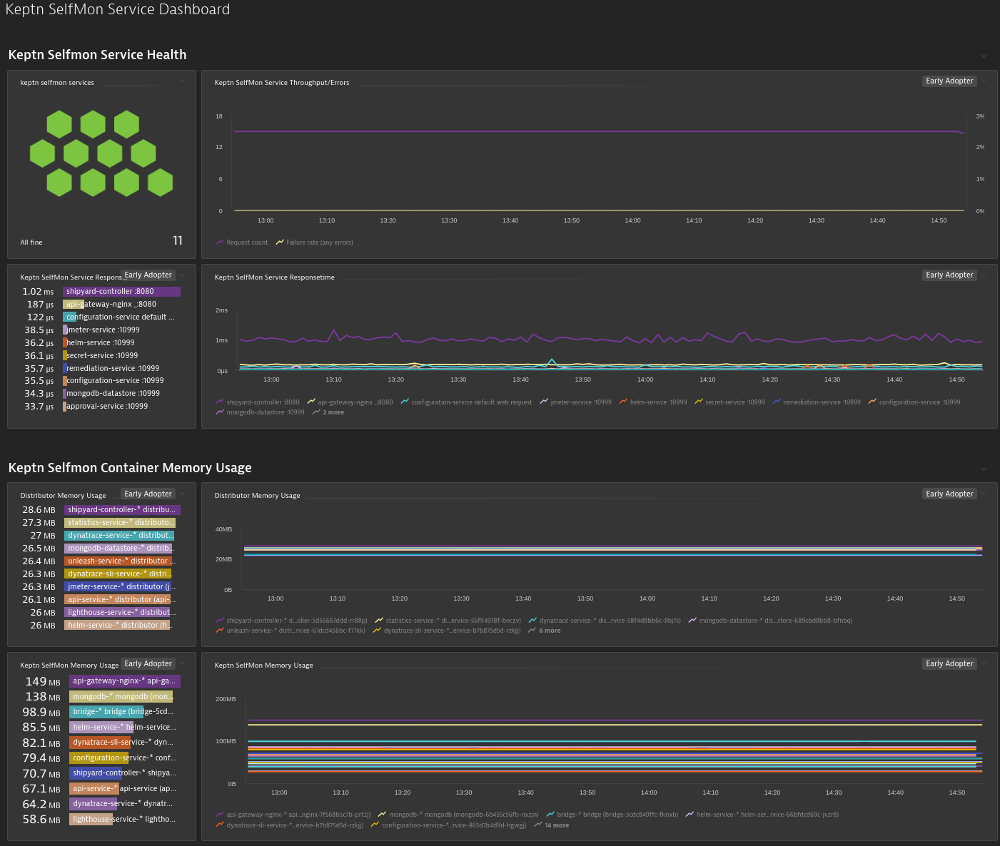
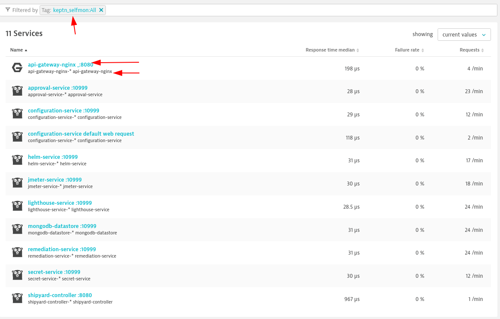

# Keptn Selfmon with Monaco

This repository holds monitoring as code (monaco) files for monitoring Keptn with Dynatrace, based on https://github.com/bacherfl/keptn-dt-monitoring .

## Instructions

1. Download and Install Monaco from https://github.com/dynatrace-oss/dynatrace-monitoring-as-code
2. Set Enviornment Variables for your DT enviornment (see `environments.yaml`), e.g.:
    ```yaml
    environment1:
      - name: "Keptn Selfmon Env"
      - env-url: "{{ .Env.DT_API_URL }}"
      - env-token-name: "DT_API_TOKEN"
    ```
    ```console
    export DT_API_URL="https://your-dt-env.live.dynatrace.com
    export DT_API_TOKEN="<insert-your-api-token-here>
    ```
3. Execute monaco as follows to verify that everything is valid:
    ```console
    monaco --environments environments.yaml --project keptn-selfmon --dry-run
    ```
4. Run it using monaco
    ```console
    export DT_API_TOKEN=<insert-dt-api-token>
    monaco --environments environments.yaml --project keptn-selfmon --dry-run
    ```

## What is created

* Auto-Tagging rules `keptn_selfmon` and `keptn_selfmon_service` are created on the *Process Group*
* Service and Process Group Naming Rules are created
* Keptn SelfMon Dashboard is created



